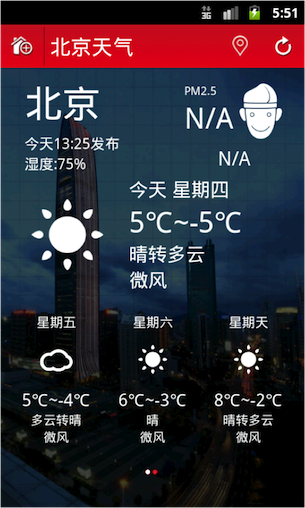

## 天气预报教学案例介绍

天气预报是大家日常生活中最熟悉的应用之一，任何同学手机中都会有一款天气预报APP。因此，在课堂上以天气预报作为教学案例，学生很容易接受。并且在实现过程中，同学可以根据自己的想法，实现一个属于自己的天气预报小应用。

## 所涉及的技术

| 序号 | 模块 | 所涉及知识点 |
| -- | -- | -- |
| 1 | 初始化工程 | android studio git |
|2|顶部工具栏制作|Activity  Layout布局 TextView、ImageView、Button等控件|
| 3 | 制作今日天气界面 | Activity  Layout布局 TextView、ImageView、Button等控件 |
| 4 | 网络状态检查 | 2:4 |
| 5 | 获取网络数据 | 2:5 |
| 6 | 解析JSON数据 | 2:6 |
| 7 | 更新今日天气数据 | 2:7 |
| 7 | 制作选择城市界面 | 2:8 |
| 8 | 从数据库中读取数据 | 2:9 |
| 9 | 通过ListView展示数据 | 2:10 |
| 10 | 处理ListView中的Item单击| 2:11 |
| 11 | 搜索城市 | 2:12 |
| 12 | 通过Service后台获取数据 | 2:13 |
| 13 | 制作未来6天天气界面 | 2:14 |
| 14 | 增加程序引导页面 | 2:15 |
| 15 | 国际化处理 | 2:16 |
| 16 | widget桌面插件 | 2:17 |
| 17 | 测试与优化 | 2:18 |
| 18 | 应用程序发布 | 2:19 |