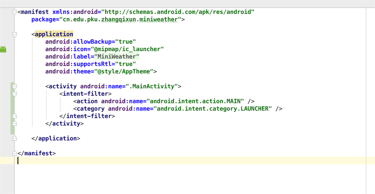

# 初始化工程

## 目录
* [创建工程](#1)
* [Acticity创建](#Activity创建)
* [TextView](#TextView)
* [Button](#Button)
* [Toast](#Toast)


## 主要步骤
<a name="1"></a>
###1.打开 Android	Studio 开发环境，如下图所示，选择“Start	a	new	Android	Studio	project”。


###2.在下图界面中，输入“Application	Name”，“Company	Domain”以及“Project	Location”信息。然后单击“Next”按钮。


###3.在下图的界面中，直接点击“Next”

###4.在下图中，选择“Add No Activity”，单击“Finish”。

###5.完成项目的创建工作，如下图所示。

###6.可以浏览一个新的项目所包含的内容。


###7.注册github账号，在Github创建一个仓库（详细步骤略）

创建成功后，如下图。

###8.安装git客户端（略）

这里只使用命令行来进行git操作。

###9.进入到minWeather的项目目录下，初始化git项目


###10.编辑.gitignore文件
在进行协作开发代码管理的过程中，常常会遇到某些临时文件、配置文件、或者生成文件等，这些文件由于不同的开发端会不一样，如果使用git add . 将所有文件纳入git库中，那么会出现频繁的改动和push，这样会引起开发上的不便。

Git可以很方便的帮助我们解决这个问题，那就是建立项目文件过滤规则。
* .gitignore 配置文件用于配置不需要加入版本管理的文件。
* Git使用.gitignore建立项目过滤规则


```
# Built application files
*.apk
*.ap_

# Files for the ART/Dalvik VM
*.dex

# Java class files
*.class

# Generated files
bin/
gen/
out/

# Gradle files
.gradle/
build/

# Local configuration file (sdk path, etc)
local.properties

# Proguard folder generated by Eclipse
proguard/

# Log Files
*.log

# Android Studio Navigation editor temp files
.navigation/

# Android Studio captures folder
captures/

# Intellij
*.iml
.idea/workspace.xml

# Keystore files
*.jks
```


###11.将项目提交到github
依次输入以下命令
* git add . 
* git commit -m "first commit" 
* git remote add origin https://github.com/zhangqixun/mini-weather-zqx.git //git地址请大家自行修改
* git push -u origin master 


###12.添加README.md文件

* touch README.md
* git add README.md
* git commit -m'Add README'
* git push

README.md文件内容如下：
```
# mini-weather
```


###13.新建一个继承Activity的Class


```
public class MainActivity extends Activity {

    @Override
    protected void onCreate(Bundle savedInstanceState) {
        super.onCreate(savedInstanceState);
    }
}

```
###14.在Layout目录下，新建一个布局文件


新建一个layout目录。接下来新建一个布局文件“weather_info”。


```
<?xml version="1.0" encoding="utf-8"?>
<RelativeLayout xmlns:android="http://schemas.android.com/apk/res/android"
    android:layout_width="match_parent"
    android:layout_height="match_parent">
<TextView
    android:layout_width="wrap_content"
    android:layout_height="wrap_content"
    android:text="天气预报项目"/>
</RelativeLayout>

```


###15.在Activity中通过调用setContentView方法加载布局


```
public class MainActivity extends Activity {

    @Override
    protected void onCreate(Bundle savedInstanceState) {
        super.onCreate(savedInstanceState);
        setContentView(R.layout.weather_info);
    }
}
```

###16.在AndroidManifest文件中注册Activity



###17.运行程序
可以再模拟器上运行，也可以在真机下运行。


###18.提交到github

* git add .
* git commit -m "init project" 
* git push


## 帮助信息
### 1、如何使用命令行创建一个新的仓库？
* git init //在当前项目目录中生成本地git管理,并建立一个隐藏.git目录
* git add . //添加当前目录中的所有文件到索引
* git commit -m "first commit" //提交到本地源码库，并附加提交注释
* git remote add origin git@github.com:zhangqixun/mini-weather-zqx.git //添加到远程项目，别名为origin
* git push -u origin master //把本地源码库push到github 别名为origin的远程项目中，确认提交


