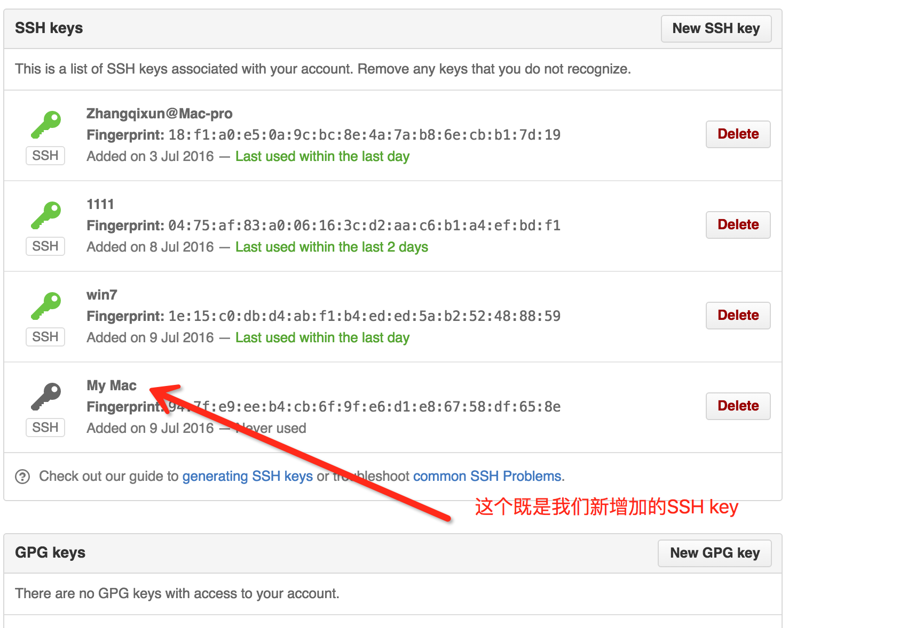
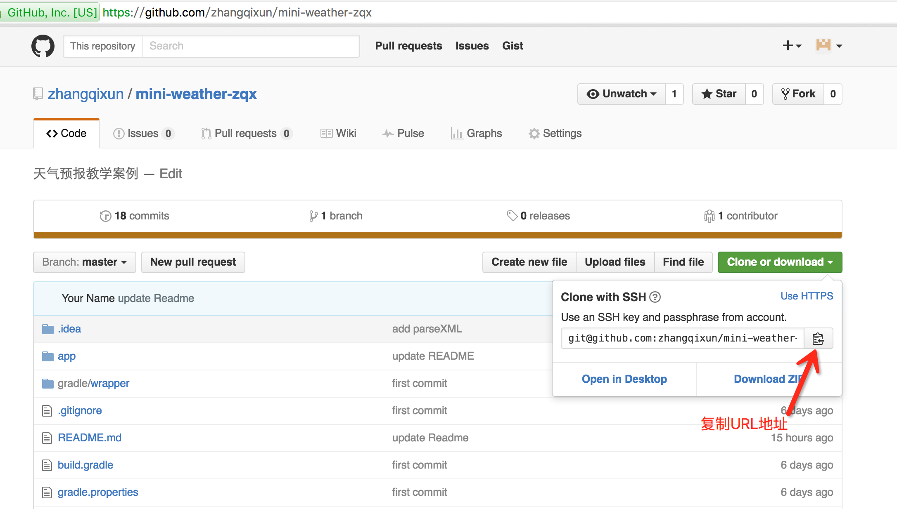
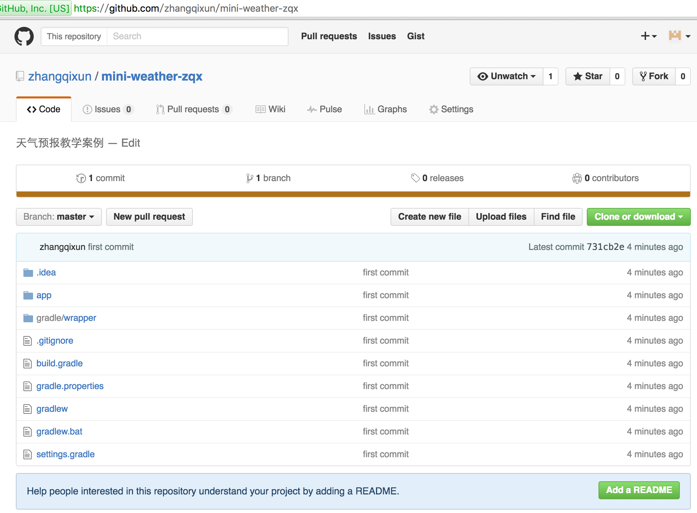

# 初始化工程


## 主要步骤

###1.打开 Android	Studio 开发环境，如下图所示，选择“Start	a	new	Android	Studio	project”。


###2.在下图界面中，输入“Application	Name”，“Company	Domain”以及“Project	Location”信息。然后单击“Next”按钮。


###3.在下图的界面中，直接点击“Next”

###4.在下图中，选择“Add No Activity”，单击“Finish”。

###5.完成项目的创建工作，如下图所示。

###6.可以浏览一个新的项目所包含的内容。


###7.注册github账号，在Github创建一个仓库（详细步骤略）

创建成功后，如下图。

###8.安装git客户端（Windows平台）

**8.1 下载并安装git安装包**

官方网站[http://git-scm.com/](http://git-scm.com/)。找到Windows版本的下载页面: [http://git-scm.com/download/win](http://git-scm.com/download/win)

或在国内相关下载中心下载。


安装过程中只有以下这个界面选择第二个选项，其他的缺省即可。一路下一步。


安装完成后，在CMD中输入 git 或者 git --version 检查时候安装成功。

**8.2 配置commit的昵称与Email以及push.default**
设置本地机器默认commit的昵称与Email. 请使用有意义的名字与email。并配置 push.default

```
git config --global user.name "zhangsan"
git config --global user.email "100000001@qq.com"
git config --global push.default simple
```

查看git配置可以使用 -l 参数

```
git config -l
```

**8.3 生成ssh公钥**
从程序的安装目录中直接打开 "Bash"


运行效果如下：


输入命令：
```
ssh-keygen
```
然后一路回车。既可以在用户目录下的“.ssh”目录下生成一个id_rsa.pub文件。


用记事本打开此文件，将里面的所有内容复制出来。例如，我的机器的公钥信息如下：
```
ssh-rsa AAAAB3NzaC1yc2EAAAADAQABAAABAQDfEuKfSf+1zHpfPmLES9ldPd2a08JslFF+PkE/uyT8Z/l1IKfadBS7c6fjJbJJCtfIsHz9WwL+ZrmqxbL0GTUeVkybFw6qRAUeZW2880si0FuHP4Ff0eZTcDEQKnrNx/zuakLYC+JKG8JsafUBe/3QgsAEOsiO79/ZQcmTrgz66ZiKi/ki80y5mc8evZR/3WSNK0eH4xneRWOtU9Upxxrbc1v/8JkHgj548VrZKZWYANoTdP/h3HjmSerpjd0KqJzS97RAOBev6hIELQ9aQn06uaghIhj3E36Q6JWANXsEcPYXy4/hbzLH4n4l235D9BDDq+ZVf zhann@ZHANGQIN4C56
```


**8.4 将ssh key添加到Github中**





###9.进入到minWeather的项目目录下，初始化git项目


###10.编辑.gitignore文件
在进行协作开发代码管理的过程中，常常会遇到某些临时文件、配置文件、或者生成文件等，这些文件由于不同的开发端会不一样，如果使用git add . 将所有文件纳入git库中，那么会出现频繁的改动和push，这样会引起开发上的不便。

Git可以很方便的帮助我们解决这个问题，那就是建立项目文件过滤规则。
* .gitignore 配置文件用于配置不需要加入版本管理的文件。
* Git使用.gitignore建立项目过滤规则

请注意文件名前面有一个点。“.gitignore”

```
# Built application files
*.apk
*.ap_

# Files for the ART/Dalvik VM
*.dex

# Java class files
*.class

# Generated files
bin/
gen/
out/

# Gradle files
.gradle/
build/

# Local configuration file (sdk path, etc)
local.properties

# Proguard folder generated by Eclipse
proguard/

# Log Files
*.log

# Android Studio Navigation editor temp files
.navigation/

# Android Studio captures folder
captures/

# Intellij
*.iml
.idea/workspace.xml

# Keystore files
*.jks
```


###11.将项目提交到github
依次输入以下命令
* git add . 
* git commit -m "first commit" 
* git remote add origin git@github.com:zhangqixun/mini-weather-zqx.git //git地址请大家自行修改
* git push -u origin master 

SSH Git地址可通过以下方式获得：




以下图片remote的URL为https方式，请大家务必使用ssh方式进行push操作。




###12.添加README.md文件

新建README.md文件。文件中增加一些说明文字的内容，例如：README.md文件内容如下：
```
# mini-weather
```
然后执行以下命令：
* git add README.md   或 git add .
* git commit -m “Add README”
* git push


###13.新建一个继承Activity的Class


```
public class MainActivity extends Activity {

    @Override
    protected void onCreate(Bundle savedInstanceState) {
        super.onCreate(savedInstanceState);
    }
}

```
###14.在Layout目录下，新建一个布局文件


新建一个layout目录。接下来新建一个布局文件“weather_info”。


```
<?xml version="1.0" encoding="utf-8"?>
<RelativeLayout xmlns:android="http://schemas.android.com/apk/res/android"
    android:layout_width="match_parent"
    android:layout_height="match_parent">
<TextView
    android:layout_width="wrap_content"
    android:layout_height="wrap_content"
    android:text="天气预报项目"/>
</RelativeLayout>

```


###15.在Activity中通过调用setContentView方法加载布局


```
public class MainActivity extends Activity {

    @Override
    protected void onCreate(Bundle savedInstanceState) {
        super.onCreate(savedInstanceState);
        setContentView(R.layout.weather_info);
    }
}
```

###16.在AndroidManifest文件中注册Activity


###17.运行程序
可以再模拟器上运行，也可以在真机下运行。


###18.提交到github

* git add .
* git commit -m "init project" 
* git push


## 帮助信息
### 1、如何使用命令行创建一个新的仓库？
* git init //在当前项目目录中生成本地git管理,并建立一个隐藏.git目录
* git add . //添加当前目录中的所有文件到索引库
* git commit -m "first commit" //将索引内容添加到仓库中。 并附加提交注释
* git remote add origin git@github.com:zhangqixun/mini-weather-zqx.git //添加一个名为“origin”的远程仓库
* git push -u origin master //把本地源码库master分支，push到远程仓库（github）别名为origin的远程仓库中，确认提交。使用-u选项指定一个默认主机，这样后面就可以不加任何参数使用git push。  git push <远程主机名> <本地分支名>:<远程分支名>


### 2、每次提交更改的文件到远程库


* git add . 
* git commit -m "提交注释信息"   
* git push 


### 3、Git其他命令
* git clone url：获取一个url对应的远程Git repo, 创建一个local copy.
* git status： 查询repo的状态
* git branch： 列出本地所有分支,当前分支会被星号标示出.
* git branch (branchname): 创建一个新的分支(当你用这种方式创建分支的时候,分支是基于你的上一次提交建立的). 
* git checkout (branchname)：切换到一个分支.
* git remote：列出remote 别名. 
* git remote rm [别名]: 删除一个存在的remote alias.
* git remote set-url [别名] [url]:更新远程repo的url. 
* git config -l：查看git config的信息
* git push -f：强推，即利用强覆盖方式用你本地的代码替代git仓库内的内容


