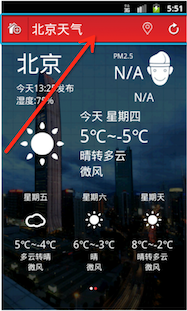

# 顶部工具栏制作

要制作的界面如图所示，可以分为四部分“工具栏”、“今日天气信息”、“一周天气信息”，“其他”。

本次任务为制作工具栏布局,本模块中，只制作顶部工具栏，包含“选择城市”、“分隔符”、“天气名称”、“定位”、“刷新”等控件。如下图所示。

 
## 资源文件

  [下载地址](http://mobile100.zhangqx.com/assets/docs/projects/weather02_res.zip)
  
## 主要步骤

### 1.将资源文件导入到

### 2.

### 3.

### 4.

### 5.

