# 制作今日天气界面


本次任务中，界面中的数据使用静态文本数据，无需连接网络获取数据。效果如下：
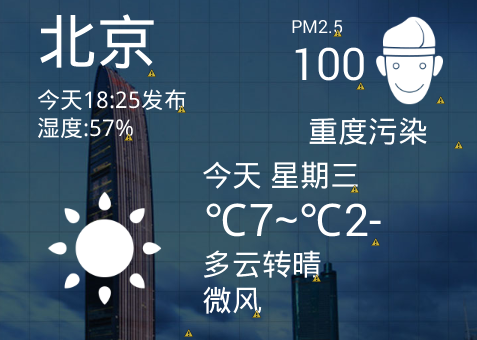


## 资源文件

[下载地址](http://mobile100.zhangqx.com/assets/docs/projects/weather03_res.zip)


## 实践内容及步骤


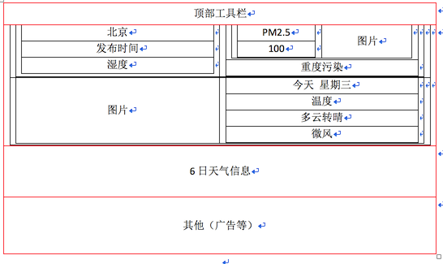


### 1.将本次实验所需的资源文件放置到相应的资源目录中
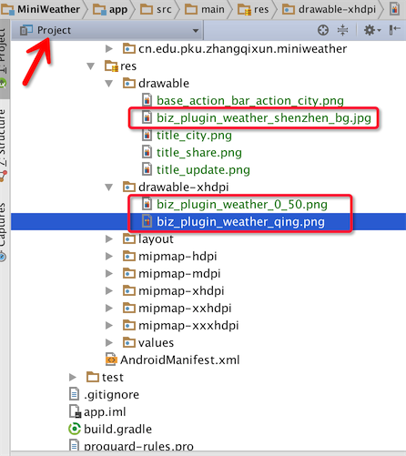


## 2.设计界面的主体框架

根据前面的分析，这里采用嵌套布局的方式，放置一个线性布局，采用垂直方式分布，分别放置今日天气、7日天气信息以及广告信息。并指定背景图片。


### 3.设计今日天气界面的框架

针对今日天气信息中主要包含的内容进行分析可知：可以将城市名称、发布时间、湿度信息等独立放置，然后将PM2.5的信息以及下方的今日天气信息块分别放到两个布局中，见下图所示。
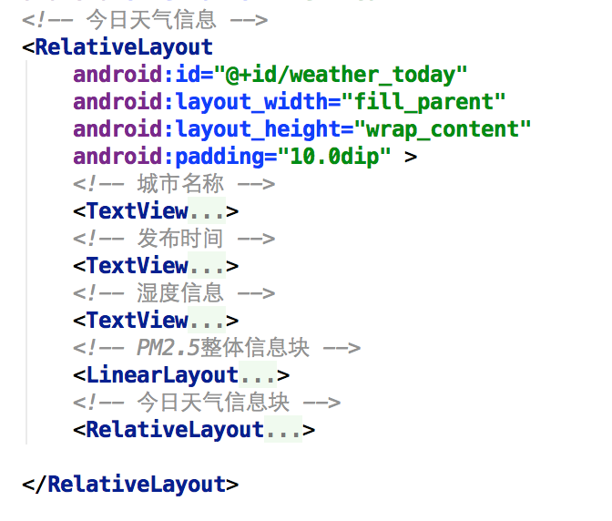

城市名称、发布时间、湿度信息的配置内容，如下图所示：
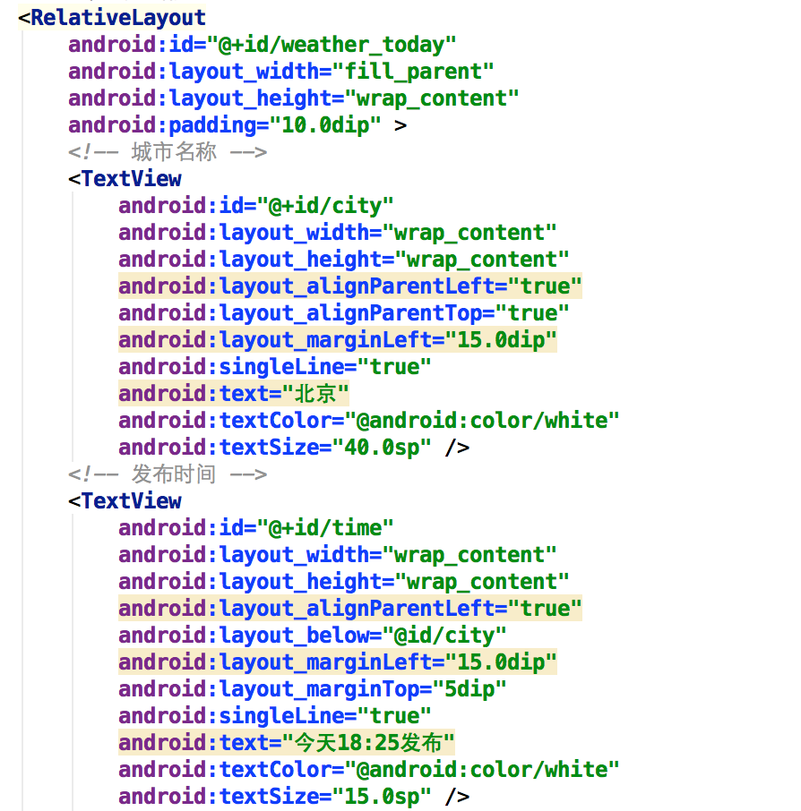


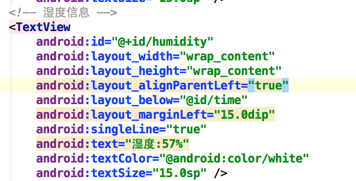


### 4.PM2.5信息块布局

PM2.5信息块的布局方式如下所示。PM2.5详情单独放到了一个线性布局中。
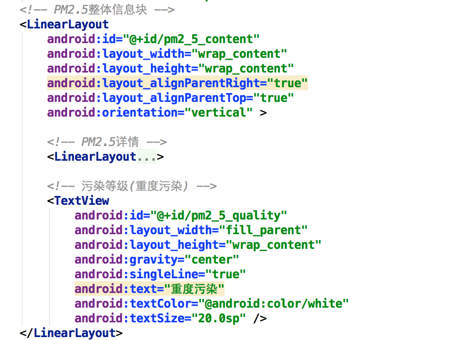

PM2.5详情如下图所示：
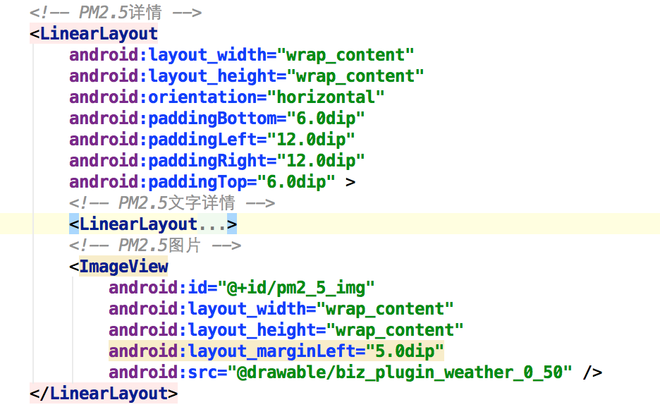
PM2.5文字详情如下：
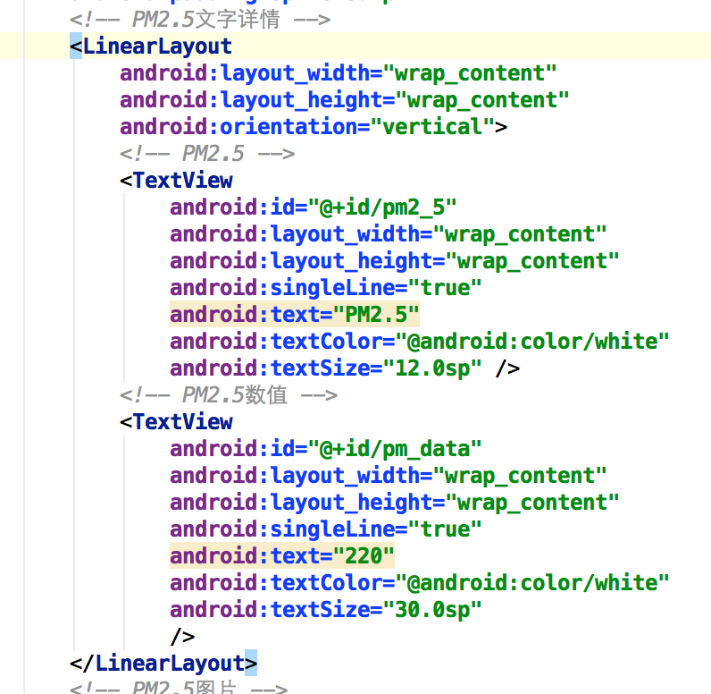


### 5.今日天气信息块布局


今日天气信息中包括天气状况图例、今日星期、温度情况、天气情况、风力信息等，这里放在了一个相对布局中。
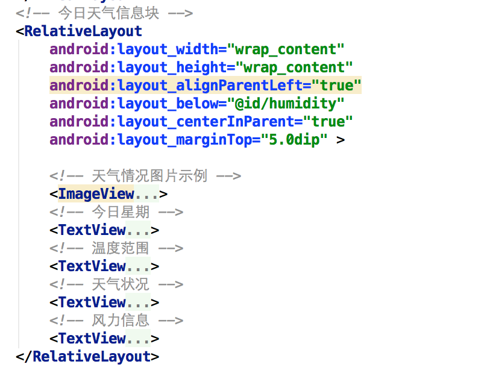
天气状况图例、今日星期、温度情况、天气情况、风力信息的具体设置如下：

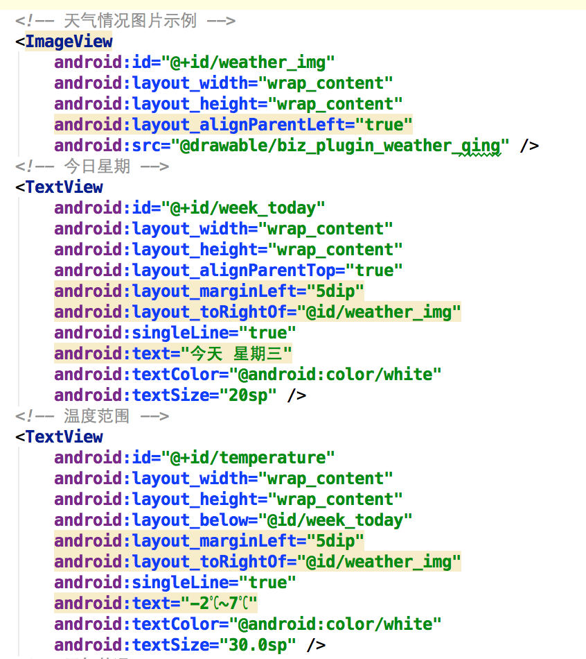
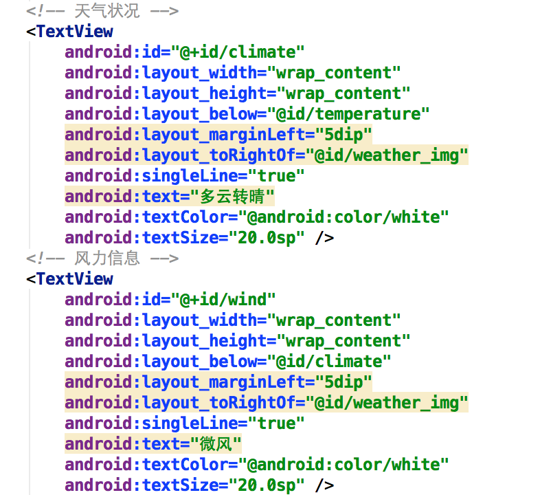

### 6.运行程序

界面效果如下图所示。


## 帮助信息


### 1.去掉系统自带的ActionBar
如果应用中包含ActionBar，如下图所示，可以使用以下方法去掉。

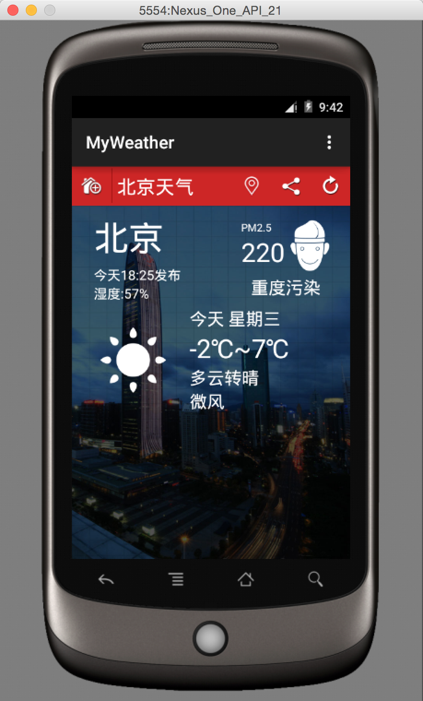

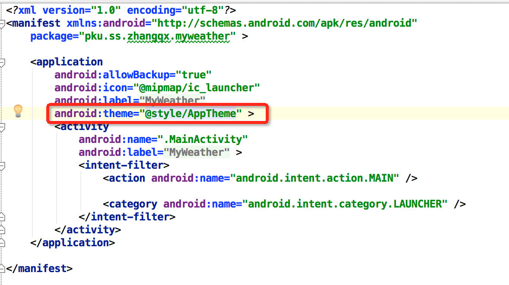

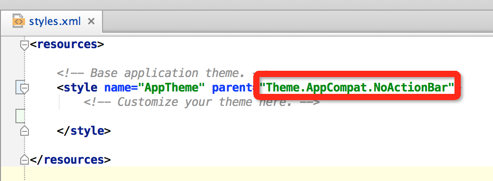

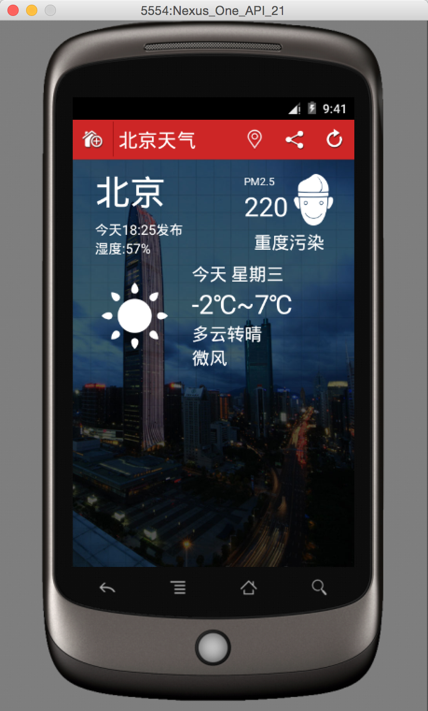


```
<?xml version="1.0" encoding="utf-8"?>
<RelativeLayout xmlns:android="http://schemas.android.com/apk/res/android"
    android:layout_width="match_parent"
    android:layout_height="match_parent">

    <RelativeLayout
        android:id="@+id/title"
        android:layout_width="fill_parent"
        android:layout_height="45.0dip"
        android:background="#ffcd2626"
        android:gravity="center_vertical">

        <ImageView
            android:id="@+id/title_city_manager"
            android:layout_width="45.0dip"
            android:layout_height="45.0dip"
            android:src="@drawable/title_city" />

        <ImageView
            android:id="@+id/city_seperator"
            android:layout_width="1.0dip"
            android:layout_height="40dip"
            android:layout_marginTop="2.0dip"
            android:layout_toRightOf="@id/title_city_manager"
            android:background="#A71717" />

        <TextView
            android:id="@+id/title_city_name"
            android:layout_width="fill_parent"
            android:layout_height="fill_parent"
            android:layout_toRightOf="@id/city_seperator"
            android:gravity="center_vertical"
            android:paddingLeft="5dip"
            android:text="北京天气"
            android:textColor="#ffffffff"
            android:textSize="22.0sp" />


        <ImageView
            android:id="@+id/title_update_btn"
            android:layout_width="45.0dip"
            android:layout_height="45.0dip"
            android:layout_alignParentRight="true"
            android:layout_gravity="center"
            android:src="@drawable/title_update"
            android:visibility="visible" />


        <ImageView
            android:id="@+id/title_share"
            android:layout_width="45.0dip"
            android:layout_height="45.0dip"
            android:layout_toLeftOf="@id/title_update_btn"
            android:src="@drawable/title_share" />

        <ImageView
            android:id="@+id/title_location"
            android:layout_width="45.0dip"
            android:layout_height="45.0dip"
            android:layout_toLeftOf="@id/title_share"
            android:src="@drawable/base_action_bar_action_city" />
    </RelativeLayout>


    <LinearLayout
        android:layout_width="fill_parent"
        android:layout_height="fill_parent"
        android:layout_below="@id/title"
        android:background="@drawable/biz_plugin_weather_shenzhen_bg"
        android:orientation="vertical" >
        <!-- 今日天气信息 -->
        <RelativeLayout
            android:id="@+id/weather_today"
            android:layout_width="fill_parent"
            android:layout_height="wrap_content"
            android:padding="10.0dip" >
            <!-- 城市名称 -->
            <TextView
                android:id="@+id/city"
                android:layout_width="wrap_content"
                android:layout_height="wrap_content"
                android:layout_alignParentLeft="true"
                android:layout_alignParentTop="true"
                android:layout_marginLeft="15.0dip"
                android:singleLine="true"
                android:text="北京"
                android:textColor="@android:color/white"
                android:textSize="40.0sp" />
            <!-- 发布时间 -->
            <TextView
                android:id="@+id/time"
                android:layout_width="wrap_content"
                android:layout_height="wrap_content"
                android:layout_alignParentLeft="true"
                android:layout_below="@id/city"
                android:layout_marginLeft="15.0dip"
                android:layout_marginTop="5dip"
                android:singleLine="true"
                android:text="今天18:25发布"
                android:textColor="@android:color/white"
                android:textSize="15.0sp" />
            <!-- 湿度信息 -->
            <TextView
                android:id="@+id/humidity"
                android:layout_width="wrap_content"
                android:layout_height="wrap_content"
                android:layout_alignParentLeft="true"
                android:layout_below="@id/time"
                android:layout_marginLeft="15.0dip"
                android:singleLine="true"
                android:text="湿度:57%"
                android:textColor="@android:color/white"
                android:textSize="15.0sp" />
            <!-- PM2.5整体信息块 -->
            <LinearLayout
                android:id="@+id/pm2_5_content"
                android:layout_width="wrap_content"
                android:layout_height="wrap_content"
                android:layout_alignParentRight="true"
                android:layout_alignParentTop="true"
                android:orientation="vertical" >

                <!-- PM2.5详情 -->
                <LinearLayout
                    android:layout_width="wrap_content"
                    android:layout_height="wrap_content"
                    android:orientation="horizontal"
                    android:paddingBottom="6.0dip"
                    android:paddingLeft="12.0dip"
                    android:paddingRight="12.0dip"
                    android:paddingTop="6.0dip" >
                    <!-- PM2.5文字详情 -->
                    <LinearLayout
                        android:layout_width="wrap_content"
                        android:layout_height="wrap_content"
                        android:orientation="vertical">
                        <!-- PM2.5 -->
                        <TextView
                            android:id="@+id/pm2_5"
                            android:layout_width="wrap_content"
                            android:layout_height="wrap_content"
                            android:singleLine="true"
                            android:text="PM2.5"
                            android:textColor="@android:color/white"
                            android:textSize="12.0sp" />
                        <!-- PM2.5数值 -->
                        <TextView
                            android:id="@+id/pm_data"
                            android:layout_width="wrap_content"
                            android:layout_height="wrap_content"
                            android:singleLine="true"
                            android:text="220"
                            android:textColor="@android:color/white"
                            android:textSize="30.0sp"
                            />
                    </LinearLayout>
                    <!-- PM2.5图片 -->
                    <ImageView
                        android:id="@+id/pm2_5_img"
                        android:layout_width="wrap_content"
                        android:layout_height="wrap_content"
                        android:layout_marginLeft="5.0dip"
                        android:src="@drawable/biz_plugin_weather_0_50" />
                </LinearLayout>

                <!-- 污染等级(重度污染) -->
                <TextView
                    android:id="@+id/pm2_5_quality"
                    android:layout_width="fill_parent"
                    android:layout_height="wrap_content"
                    android:gravity="center"
                    android:singleLine="true"
                    android:text="重度污染"
                    android:textColor="@android:color/white"
                    android:textSize="20.0sp" />
            </LinearLayout>
            <!-- 今日天气信息块 -->
            <RelativeLayout
                android:layout_width="wrap_content"
                android:layout_height="wrap_content"
                android:layout_alignParentLeft="true"
                android:layout_below="@id/humidity"
                android:layout_centerInParent="true"
                android:layout_marginTop="5.0dip" >

                <!-- 天气情况图片示例 -->
                <ImageView
                    android:id="@+id/weather_img"
                    android:layout_width="wrap_content"
                    android:layout_height="wrap_content"
                    android:layout_alignParentLeft="true"
                    android:src="@drawable/biz_plugin_weather_qing" />
                <!-- 今日星期 -->
                <TextView
                    android:id="@+id/week_today"
                    android:layout_width="wrap_content"
                    android:layout_height="wrap_content"
                    android:layout_alignParentTop="true"
                    android:layout_marginLeft="5dip"
                    android:layout_toRightOf="@id/weather_img"
                    android:singleLine="true"
                    android:text="今天 星期三"
                    android:textColor="@android:color/white"
                    android:textSize="20sp" />
                <!-- 温度范围 -->
                <TextView
                    android:id="@+id/temperature"
                    android:layout_width="wrap_content"
                    android:layout_height="wrap_content"
                    android:layout_below="@id/week_today"
                    android:layout_marginLeft="5dip"
                    android:layout_toRightOf="@id/weather_img"
                    android:singleLine="true"
                    android:text="-2℃~7℃"
                    android:textColor="@android:color/white"
                    android:textSize="30.0sp" />
                <!-- 天气状况 -->
                <TextView
                    android:id="@+id/climate"
                    android:layout_width="wrap_content"
                    android:layout_height="wrap_content"
                    android:layout_below="@id/temperature"
                    android:layout_marginLeft="5dip"
                    android:layout_toRightOf="@id/weather_img"
                    android:singleLine="true"
                    android:text="多云转晴"
                    android:textColor="@android:color/white"
                    android:textSize="20.0sp" />
                <!-- 风力信息 -->
                <TextView
                    android:id="@+id/wind"
                    android:layout_width="wrap_content"
                    android:layout_height="wrap_content"
                    android:layout_below="@id/climate"
                    android:layout_marginLeft="5dip"
                    android:layout_toRightOf="@id/weather_img"
                    android:singleLine="true"
                    android:text="微风"
                    android:textColor="@android:color/white"
                    android:textSize="20.0sp" />
            </RelativeLayout>

        </RelativeLayout>

        <!-- 六日天气信息 -->

        <!-- 广告等信息 -->

    </LinearLayout>

</RelativeLayout>

```


