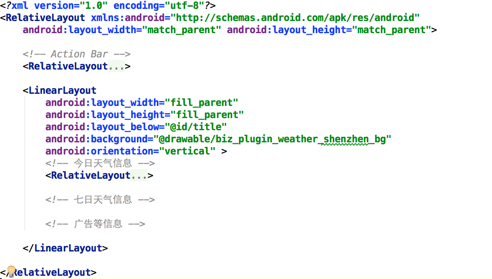

# 制作今日天气界面

本次任务中，界面中的数据使用静态文本数据，无需连接网络获取数据。效果如下：

## 资源文件

[下载地址](http://mobile100.zhangqx.com/assets/docs/projects/weather03_res.zip)

## 实践内容及步骤

### 1.将本次实验所需的资源文件放置到相应的资源目录中

## 2.设计界面的主体框架

根据前面的分析，这里采用嵌套布局的方式，放置一个线性布局，采用垂直方式分布，分别放置今日天气、7日天气信息以及广告信息。并指定背景图片。

### 3.设计今日天气界面的框架

针对今日天气信息中主要包含的内容进行分析可知：可以将城市名称、发布时间、湿度信息等独立放置，然后将PM2.5的信息以及下方的今日天气信息块分别放到两个布局中，见下图所示。

城市名称、发布时间、湿度信息的配置内容，如下图所示：

### 4.PM2.5信息块布局

PM2.5信息块的布局方式如下所示。PM2.5详情单独放到了一个线性布局中。

PM2.5详情如下图所示：

PM2.5文字详情如下：

### 5.今日天气信息块布局

今日天气信息中包括天气状况图例、今日星期、温度情况、天气情况、风力信息等，这里放在了一个相对布局中。

天气状况图例、今日星期、温度情况、天气情况、风力信息的具体设置如下：

### 6.运行程序

界面效果如下图所示。

## 帮助信息

### 1.去掉系统自带的ActionBar
如果应用中包含ActionBar，如下图所示，可以使用以下方法去掉。

