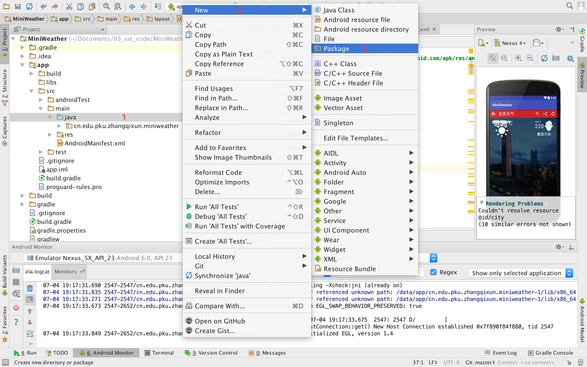
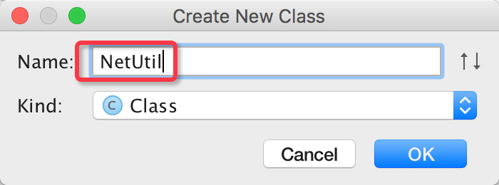
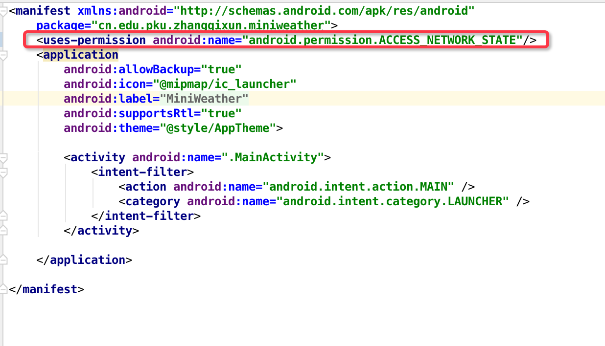

# 网络状态检查

应用程序在访问网络资源时，需要先检测网络状态，如果网络不可用，需要提示用户请打开网络，或检查网络连接状况。

因此本次任务是制作一个工具类，用于检查网络状态。


## 主要步骤


### 1.创建一个util包，存放公共的工具类



### 2.在util文件夹中创建一个NetUtil类


### 3.在NetUtil类中实现getNetworkState方法


### 4.调用检测网络连接状态方法

在连接网络之前，可以直接通过以下语句检测网络是否连接。

     NetUtil.getNetworkState(this) != NetUtil.NETWORN_NONE
              
需要增加访问网络状态的权限。




```
package cn.edu.pku.zhangqixun.util;

import android.content.Context;
import android.net.ConnectivityManager;
import android.net.NetworkInfo;

/**
 * Created by zhangqixun on 16/7/4.
 */
public class NetUtil {
    public static final int NETWORN_NONE = 0;
    public static final int NETWORN_WIFI = 1;
    public static final int NETWORN_MOBILE = 2;

    public static int getNetworkState(Context context) {
        ConnectivityManager connManager = (ConnectivityManager) context
                .getSystemService(Context.CONNECTIVITY_SERVICE);

        NetworkInfo networkInfo = connManager.getActiveNetworkInfo();
        if (networkInfo == null) {
            return NETWORN_NONE;
        }

        int nType = networkInfo.getType();
        if (nType == ConnectivityManager.TYPE_MOBILE) {
            return NETWORN_MOBILE;
        } else if (nType == ConnectivityManager.TYPE_WIFI) {
            return NETWORN_WIFI;
        }
        return NETWORN_NONE;
    }


}

```


