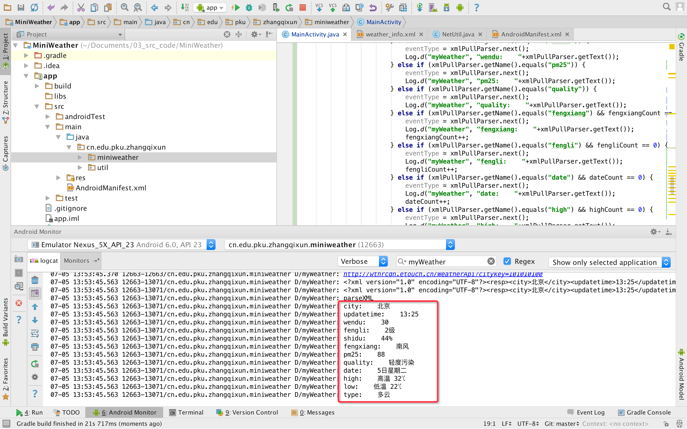

# 解析网络数据


## 主要步骤


### 1.编写解析函数，解析出城市名称已经更新时间信息


### 2.在获取网络数据后，调用解析函数


程序运行结果如下，可以将城市信息以及更新时间解析出来。如下图所示。


### 3.完善解析程序，将其他所需的信息解析出来
```
private void parseXML(String xmldata) {
        int fengxiangCount=0;
        int fengliCount =0;
        int dateCount=0;
        int highCount =0;
        int lowCount=0;
        int typeCount =0;
        try {
            XmlPullParserFactory fac = XmlPullParserFactory.newInstance();
            XmlPullParser xmlPullParser = fac.newPullParser();
            xmlPullParser.setInput(new StringReader(xmldata));
            int eventType = xmlPullParser.getEventType();
            Log.d("myWeather", "parseXML");
            while (eventType != XmlPullParser.END_DOCUMENT) {
                switch (eventType) {
                    // 判断当前事件是否为文档开始事件
                    case XmlPullParser.START_DOCUMENT:
                        break;
                    // 判断当前事件是否为标签元素开始事件
                    case XmlPullParser.START_TAG:
                        if (xmlPullParser.getName().equals("city")) {
                            eventType = xmlPullParser.next();
                            Log.d("myWeather", "city:    "+xmlPullParser.getText());

                        } else if (xmlPullParser.getName().equals("updatetime")) {
                            eventType = xmlPullParser.next();
                            Log.d("myWeather", "updatetime:    "+xmlPullParser.getText());
                        }else if (xmlPullParser.getName().equals("shidu")) {
                            eventType = xmlPullParser.next();
                            Log.d("myWeather", "shidu:    "+xmlPullParser.getText());
                        } else if (xmlPullParser.getName().equals("wendu")) {
                            eventType = xmlPullParser.next();
                            Log.d("myWeather", "wendu:    "+xmlPullParser.getText());
                        } else if (xmlPullParser.getName().equals("pm25")) {
                            eventType = xmlPullParser.next();
                            Log.d("myWeather", "pm25:    "+xmlPullParser.getText());
                        } else if (xmlPullParser.getName().equals("quality")) {
                            eventType = xmlPullParser.next();
                            Log.d("myWeather", "quality:    "+xmlPullParser.getText());
                        } else if (xmlPullParser.getName().equals("fengxiang") && fengxiangCount == 0) {
                            eventType = xmlPullParser.next();
                            Log.d("myWeather", "fengxiang:    "+xmlPullParser.getText());
                            fengxiangCount++;
                        } else if (xmlPullParser.getName().equals("fengli") && fengliCount == 0) {
                            eventType = xmlPullParser.next();
                            Log.d("myWeather", "fengli:    "+xmlPullParser.getText());
                            fengliCount++;
                        } else if (xmlPullParser.getName().equals("date") && dateCount == 0) {
                            eventType = xmlPullParser.next();
                            Log.d("myWeather", "date:    "+xmlPullParser.getText());
                            dateCount++;
                        } else if (xmlPullParser.getName().equals("high") && highCount == 0) {
                            eventType = xmlPullParser.next();
                            Log.d("myWeather", "high:    "+xmlPullParser.getText());
                            highCount++;
                        } else if (xmlPullParser.getName().equals("low") && lowCount == 0) {
                            eventType = xmlPullParser.next();
                            Log.d("myWeather", "low:    "+xmlPullParser.getText());
                            lowCount++;
                        } else if (xmlPullParser.getName().equals("type") && typeCount == 0) {
                            eventType = xmlPullParser.next();
                            Log.d("myWeather", "type:    "+xmlPullParser.getText());
                            typeCount++;
                        }
                        break;
                    // 判断当前事件是否为标签元素结束事件
                    case XmlPullParser.END_TAG:
                        break;
                }
                // 进入下一个元素并触发相应事件
                eventType = xmlPullParser.next();
            }
        } catch (XmlPullParserException e) {
            e.printStackTrace();
        } catch (IOException e) {
            e.printStackTrace();
        }
    }
```


### 4.程序运行结果




