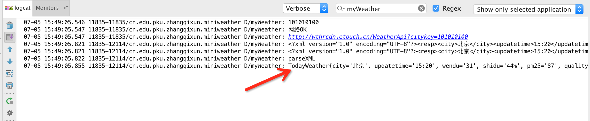
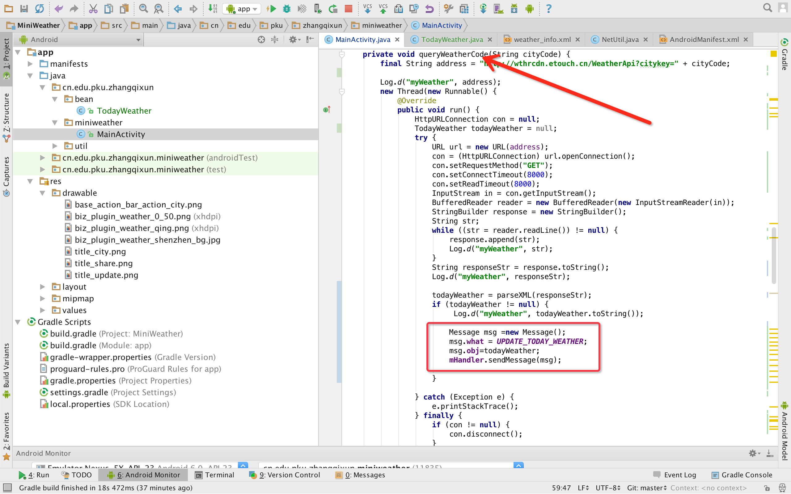

# 更新今日天气数据


资源文件: [下载地址](http://mobile100.zhangqx.com/assets/docs/projects/weather07_res.zip)


## 主要步骤


###1. 初始化界面控件 
定义相关的控件对象

```
 private TextView cityTv, timeTv, humidityTv, weekTv, pmDataTv, pmQualityTv,
            temperatureTv, climateTv, windTv, city_name_Tv;
    private ImageView weatherImg, pmImg;
```

初始化控件内容


```
    void initView(){
        city_name_Tv = (TextView) findViewById(R.id.title_city_name);
        cityTv = (TextView) findViewById(R.id.city);
        timeTv = (TextView) findViewById(R.id.time);
        humidityTv = (TextView) findViewById(R.id.humidity);
        weekTv = (TextView) findViewById(R.id.week_today);
        pmDataTv = (TextView) findViewById(R.id.pm_data);
        pmQualityTv = (TextView) findViewById(R.id.pm2_5_quality);
        pmImg = (ImageView) findViewById(R.id.pm2_5_img);
        temperatureTv = (TextView) findViewById(R.id.temperature);
        climateTv = (TextView) findViewById(R.id.climate);
        windTv = (TextView) findViewById(R.id.wind);
        weatherImg = (ImageView) findViewById(R.id.weather_img);

        city_name_Tv.setText("N/A");
        cityTv.setText("N/A");
        timeTv.setText("N/A");
        humidityTv.setText("N/A");
        pmDataTv.setText("N/A");
        pmQualityTv.setText("N/A");
        weekTv.setText("N/A");
        temperatureTv.setText("N/A");
        climateTv.setText("N/A");
        windTv.setText("N/A");
    }
```

在onCreate方法中调用initView函数。


程序运行结果如下


### 2.建立 TodayWeather Bean


新建TodayWeather类


通过工具提供的功能生成get、set、toString方法。

......


### 3.将解析的数据存入TodayWeather对象中

修改解析函数
```
 private TodayWeather parseXML(String xmldata){
        TodayWeather todayWeather = null;
        int fengxiangCount=0;
        int fengliCount =0;
        int dateCount=0;
        int highCount =0;
        int lowCount=0;
        int typeCount =0;
        try {
            XmlPullParserFactory fac = XmlPullParserFactory.newInstance();
            XmlPullParser xmlPullParser = fac.newPullParser();
            xmlPullParser.setInput(new StringReader(xmldata));
            int eventType = xmlPullParser.getEventType();
            Log.d("myWeather", "parseXML");
            while (eventType != XmlPullParser.END_DOCUMENT) {
                switch (eventType) {
                    // 判断当前事件是否为文档开始事件
                    case XmlPullParser.START_DOCUMENT:
                        break;
                    // 判断当前事件是否为标签元素开始事件
                    case XmlPullParser.START_TAG:
                        if(xmlPullParser.getName().equals("resp")){
                            todayWeather= new TodayWeather();
                        }
                        if (todayWeather != null) {
                            if (xmlPullParser.getName().equals("city")) {
                                eventType = xmlPullParser.next();
                                todayWeather.setCity(xmlPullParser.getText());
                            } else if (xmlPullParser.getName().equals("updatetime")) {
                                eventType = xmlPullParser.next();
                                todayWeather.setUpdatetime(xmlPullParser.getText());
                            } else if (xmlPullParser.getName().equals("shidu")) {
                                eventType = xmlPullParser.next();
                                todayWeather.setShidu(xmlPullParser.getText());
                            } else if (xmlPullParser.getName().equals("wendu")) {
                                eventType = xmlPullParser.next();
                                todayWeather.setWendu(xmlPullParser.getText());
                            } else if (xmlPullParser.getName().equals("pm25")) {
                                eventType = xmlPullParser.next();
                                todayWeather.setPm25(xmlPullParser.getText());
                            } else if (xmlPullParser.getName().equals("quality")) {
                                eventType = xmlPullParser.next();
                                todayWeather.setQuality(xmlPullParser.getText());
                            } else if (xmlPullParser.getName().equals("fengxiang") && fengxiangCount == 0) {
                                eventType = xmlPullParser.next();
                                todayWeather.setFengxiang(xmlPullParser.getText());
                                fengxiangCount++;
                            } else if (xmlPullParser.getName().equals("fengli") && fengliCount == 0) {
                                eventType = xmlPullParser.next();
                                todayWeather.setFengli(xmlPullParser.getText());
                                fengliCount++;
                            } else if (xmlPullParser.getName().equals("date") && dateCount == 0) {
                                eventType = xmlPullParser.next();
                                todayWeather.setDate(xmlPullParser.getText());
                                dateCount++;
                            } else if (xmlPullParser.getName().equals("high") && highCount == 0) {
                                eventType = xmlPullParser.next();
                                todayWeather.setHigh(xmlPullParser.getText().substring(2).trim());
                                highCount++;
                            } else if (xmlPullParser.getName().equals("low") && lowCount == 0) {
                                eventType = xmlPullParser.next();
                                todayWeather.setLow(xmlPullParser.getText().substring(2).trim());
                                lowCount++;
                            } else if (xmlPullParser.getName().equals("type") && typeCount == 0) {
                                eventType = xmlPullParser.next();
                                todayWeather.setType(xmlPullParser.getText());
                                typeCount++;
                            }
                        }

                        break;


                    // 判断当前事件是否为标签元素结束事件
                    case XmlPullParser.END_TAG:
                        break;
                }
                // 进入下一个元素并触发相应事件
                eventType = xmlPullParser.next();
            }
        } catch (XmlPullParserException e) {
            e.printStackTrace();
        } catch (IOException e) {
            e.printStackTrace();
        }
        return todayWeather;
    }

```
调用parseXML，并返回TodayWeather对象。

运行结果如下：


### 4.利用TodayWeather对象更新UI中的控件


编写 updateTodayWeather 函数。
```
void updateTodayWeather(TodayWeather todayWeather){
        city_name_Tv.setText(todayWeather.getCity()+"天气");
        cityTv.setText(todayWeather.getCity());
        timeTv.setText(todayWeather.getUpdatetime()+ "发布");
        humidityTv.setText("湿度："+todayWeather.getShidu());
        pmDataTv.setText(todayWeather.getPm25());
        pmQualityTv.setText(todayWeather.getQuality());
        weekTv.setText(todayWeather.getDate());
        temperatureTv.setText(todayWeather.getHigh()+"~"+todayWeather.getLow());
        climateTv.setText(todayWeather.getType());
        windTv.setText("风力:"+todayWeather.getFengli());
        Toast.makeText(MainActivity.this,"更新成功！",Toast.LENGTH_SHORT).show();

    }

```
通过消息机制，将解析的天气对象，通过消息发送给主线程，主线程接收到消息数据后，调用updateTodayWeather函数，更新UI界面上的数据。




程序运行结果：


单击更新后，界面如下：


备注：
1. 兰州城市代码为：101160101
2. 关于如何更新ImageView，请大家尝试自行完成，相应的图片资源文件已经提供。


