# 制作选择城市界面

资源文件：[下载地址](http://mobile100.zhangqx.com/assets/docs/projects/weather08_res.zip)

## 主要步骤
### 1.添加“选择城市”的布局文件

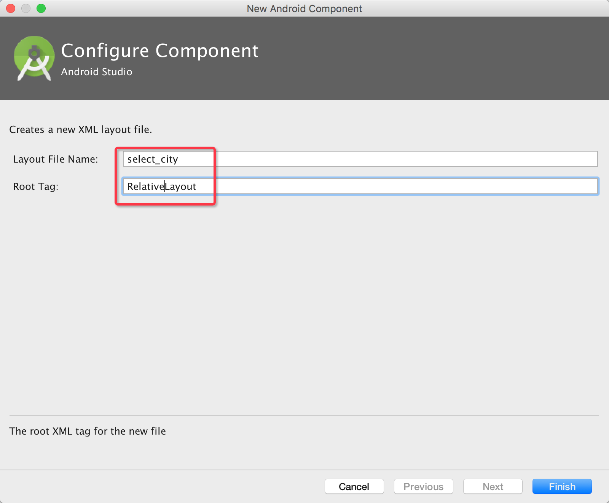

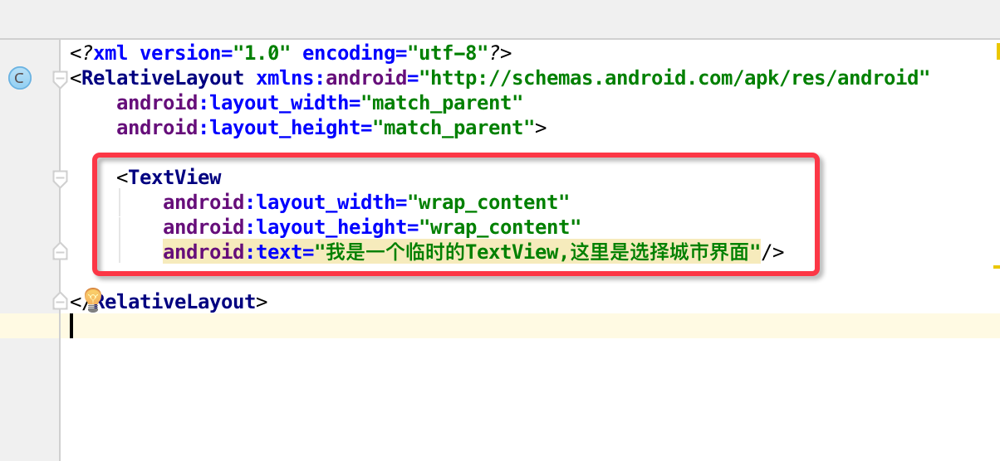
### 2.添加选择城市Activity

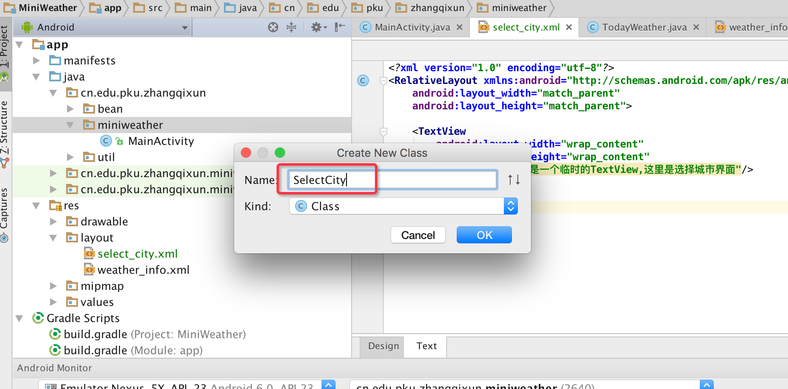
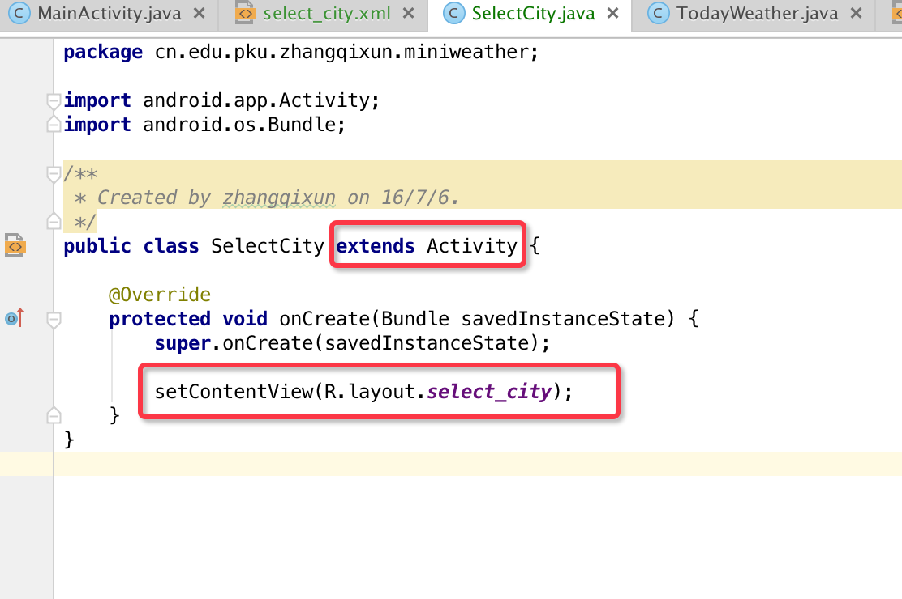


### 3.为选择城市ImageView添加OnClick事件

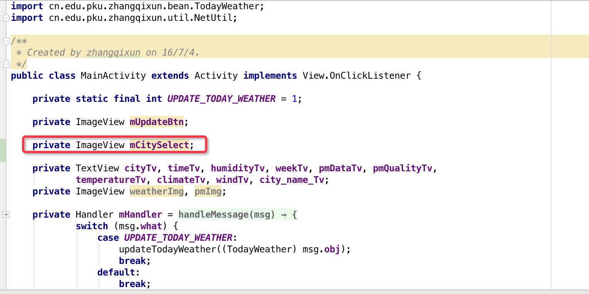

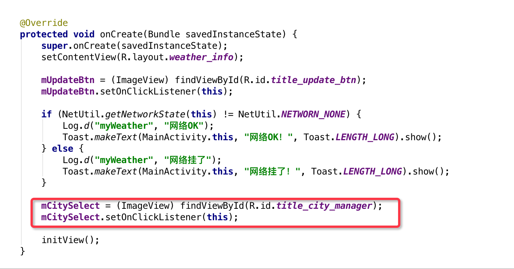

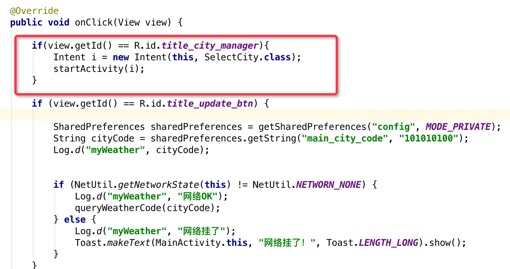

运行程序：
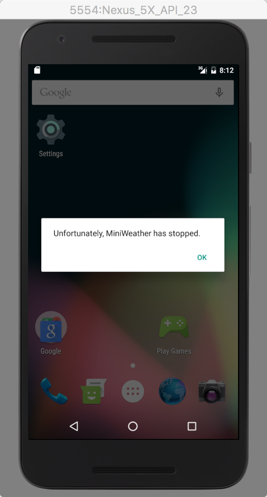

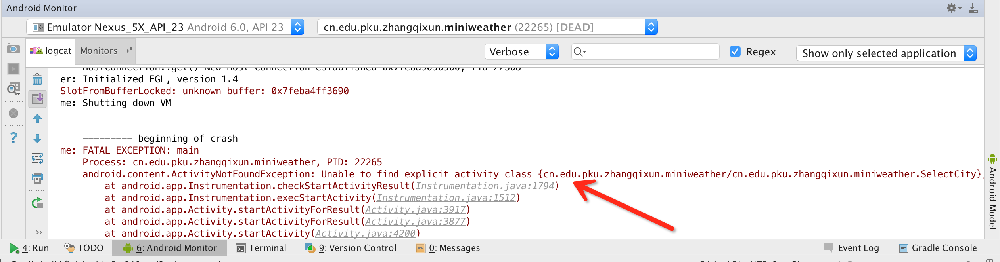

因为没有在Androidmanifest文件中注册Activity组件。

### 4.在AndroidManifest.xml文件中注册Activity

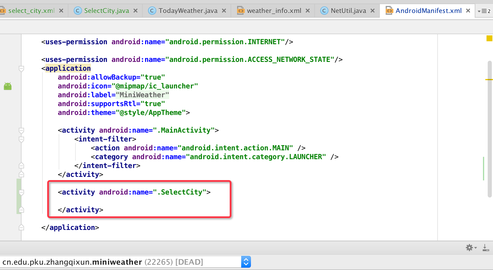

运行结果如下
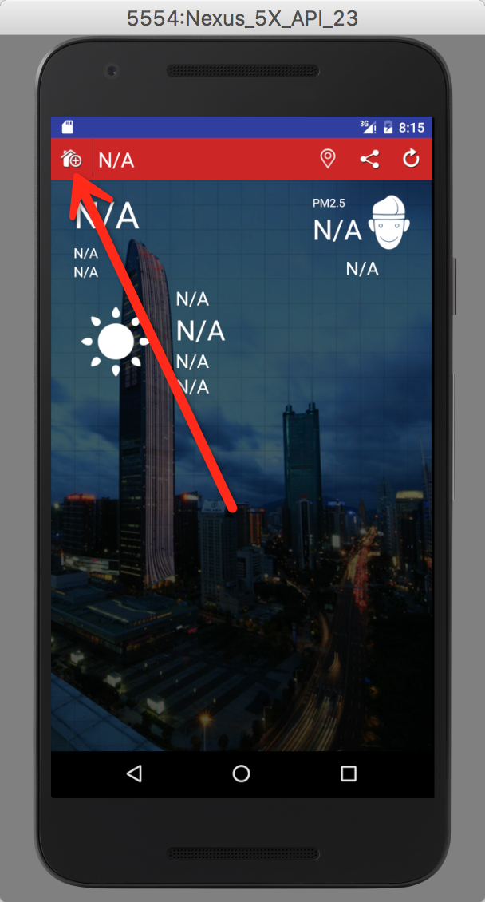
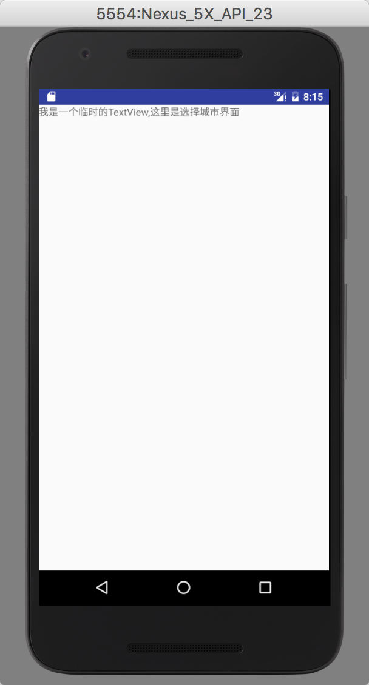

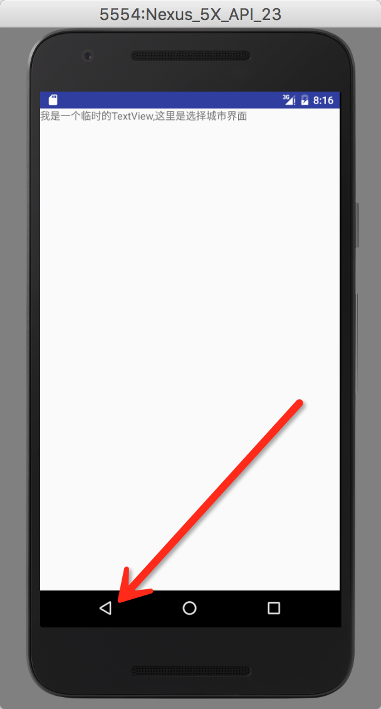


### 5.完善选择城市界面布局
将资源文件导入到drawable目录中。
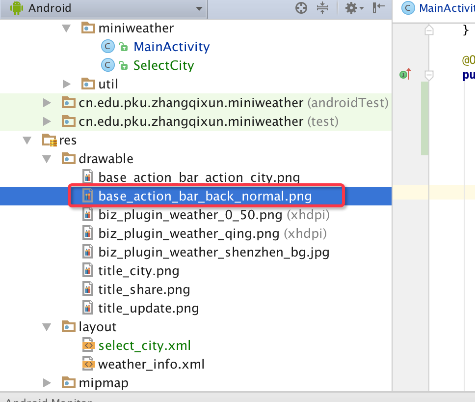

修改布局文件
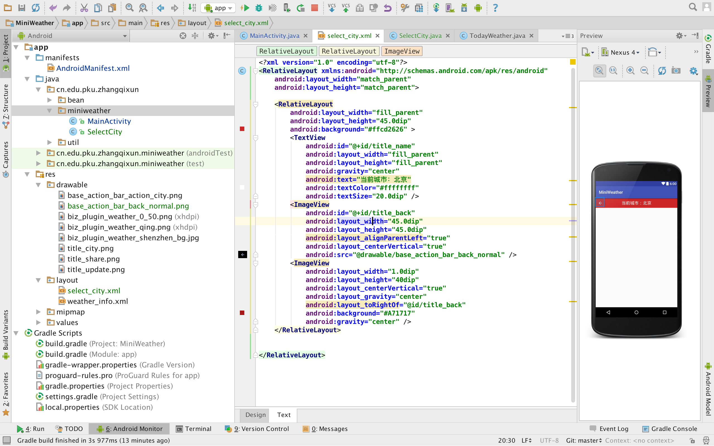
```
<?xml version="1.0" encoding="utf-8"?>
<RelativeLayout xmlns:android="http://schemas.android.com/apk/res/android"
    android:layout_width="match_parent"
    android:layout_height="match_parent">

    <RelativeLayout
        android:layout_width="fill_parent"
        android:layout_height="45.0dip"
        android:background="#ffcd2626" >
        <TextView
            android:id="@+id/title_name"
            android:layout_width="fill_parent"
            android:layout_height="fill_parent"
            android:gravity="center"
            android:text="当前城市：北京"
            android:textColor="#ffffffff"
            android:textSize="20.0dip" />
        <ImageView
            android:id="@+id/title_back"
            android:layout_width="45.0dip"
            android:layout_height="45.0dip"
            android:layout_alignParentLeft="true"
            android:layout_centerVertical="true"
            android:src="@drawable/base_action_bar_back_normal" />
        <ImageView
            android:layout_width="1.0dip"
            android:layout_height="40dip"
            android:layout_centerVertical="true"
            android:layout_gravity="center"
            android:layout_toRightOf="@id/title_back"
            android:background="#A71717"
            android:gravity="center" />
    </RelativeLayout>


</RelativeLayout>
```

### 6.为选择城市界面的返回(ImageView)设置OnClick事件

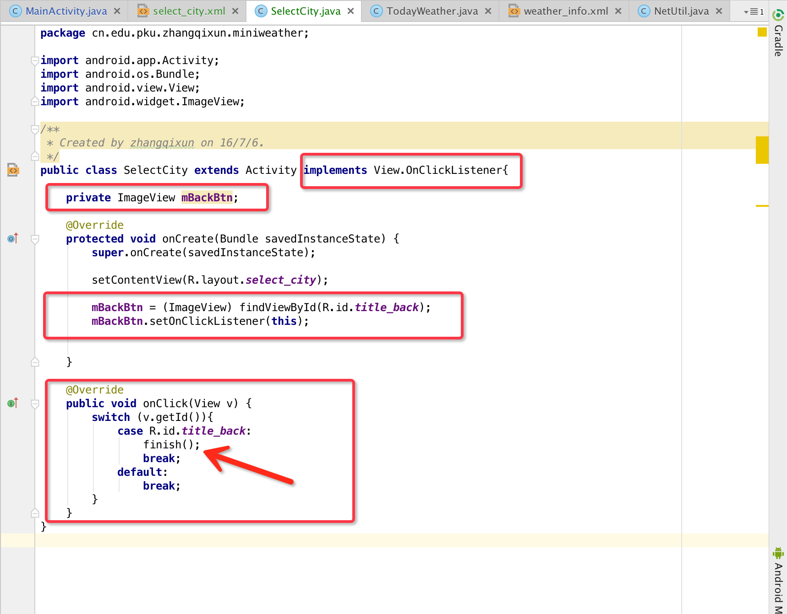
### 7.运行程序
效果图如下方图例所示。至此本任务完成。

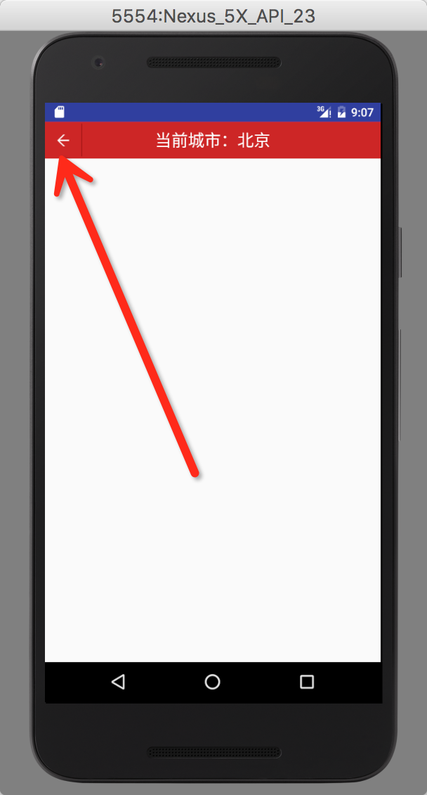

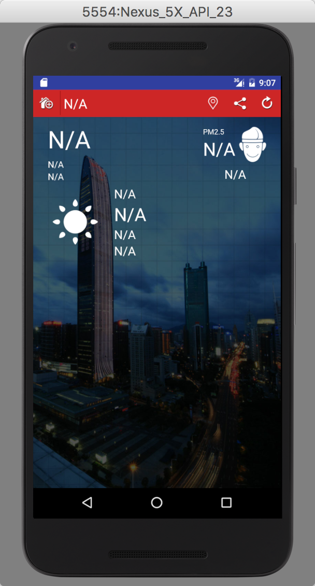


