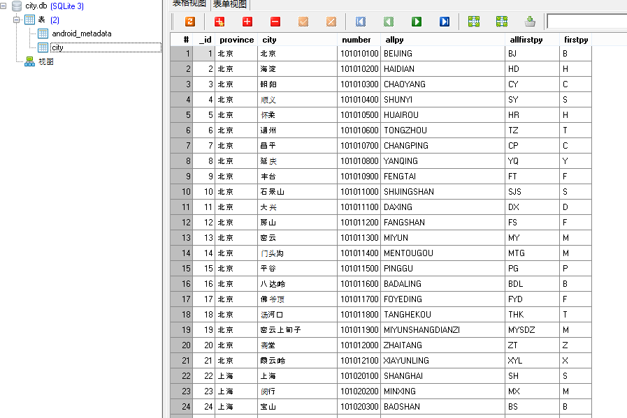

# 从数据库中读取城市列表


数据库文件：[下载地址](http://mobile100.zhangqx.com/assets/docs/projects/weather09_res.zip)

city.db城市数据库文件格式如下



## 主要步骤


### 1.将数据库文件导入到assets目录


### 2.建立City的Bean


```
    private String province;
    private String city;
    private String number;
    private String firstPY;
    private String allPY;
    private String allFristPY;
```
增加一个构造函数City

```
 public City(String province, String city, String number, String firstPY, String allPY, String allFristPY) {
        this.province = province;
        this.city = city;
        this.number = number;
        this.firstPY = firstPY;
        this.allPY = allPY;
        this.allFristPY = allFristPY;
    }
```

### 3.建立MyApplication类


在AndroidManifest.xml文件中注册Application，代码如下图所示：


运行程序结果如下：

### 4.在MyApplication类中创建geiInstance方法


```
    private static MyApplication mApplication;
```
```
        mApplication = this;
```
```
    public static MyApplication getInstance(){
        return  mApplication;
    }
```

### 5.创建CityDB操作类


```
public class CityDB {
    public static final String CITY_DB_NAME = "city.db";
    private static final String CITY_TABLE_NAME = "city";
    private SQLiteDatabase db;

    public CityDB(Context context, String path) {
        db = context.openOrCreateDatabase(path, Context.MODE_PRIVATE, null);
    }

    public List<City> getAllCity() {
        List<City> list = new ArrayList<City>();
        Cursor c = db.rawQuery("SELECT * from " + CITY_TABLE_NAME, null);
        while (c.moveToNext()) {
            String province = c.getString(c.getColumnIndex("province"));
            String city = c.getString(c.getColumnIndex("city"));
            String number = c.getString(c.getColumnIndex("number"));
            String allPY = c.getString(c.getColumnIndex("allpy"));
            String allFirstPY = c.getString(c.getColumnIndex("allfirstpy"));
            String firstPY = c.getString(c.getColumnIndex("firstpy"));
            City item = new City(province, city, number, firstPY, allPY,allFirstPY);
            list.add(item);
        }
        return list;
    }
}
```
### 6.创建打开数据库的方法


```
private CityDB openCityDB() {
        String path = "/data"
                + Environment.getDataDirectory().getAbsolutePath()
                + File.separator + getPackageName()
                + File.separator + "databases1"
                + File.separator
                + CityDB.CITY_DB_NAME;
        File db = new File(path);
        Log.d(TAG,path);
        if (!db.exists()) {

            String pathfolder = "/data"
                    + Environment.getDataDirectory().getAbsolutePath()
                    + File.separator + getPackageName()
                    + File.separator + "databases1"
                    + File.separator;
            File dirFirstFolder = new File(pathfolder);
            if(!dirFirstFolder.exists()){
                dirFirstFolder.mkdirs();
                Log.i("MyApp","mkdirs");
            }
            Log.i("MyApp","db is not exists");
            try {
                InputStream is = getAssets().open("city.db");
                FileOutputStream fos = new FileOutputStream(db);
                int len = -1;
                byte[] buffer = new byte[1024];
                while ((len = is.read(buffer)) != -1) {
                    fos.write(buffer, 0, len);
                    fos.flush();
                }
                fos.close();
                is.close();
            } catch (IOException e) {
                e.printStackTrace();
                System.exit(0);
            }
        }
        return new CityDB(this, path);
    }
```

在Application类中，打开数据库。


```
     private CityDB mCityDB;
```
```
    mCityDB = openCityDB();
```

### 7.初始化城市信息列表

### 8.在程序运行时调用数据库访问方法

程序运行结果如下，可以在程序运行时，在Application对象中打开数据库，并取出城市列表信息数据。


